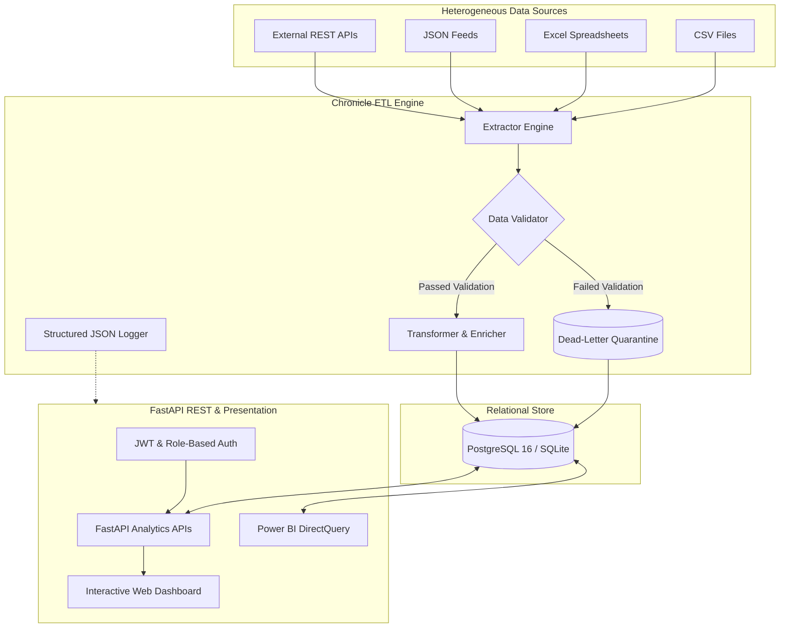
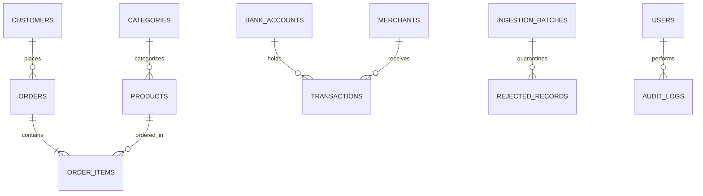

# Chronicle: Enterprise Cloud Data Ingestion & Analytics Platform

[](https://github.com/Spidey173/Chronicle/actions)
[](https://www.python.org/)
[](https://fastapi.tiangolo.com)
[](https://www.postgresql.org/)
[](https://www.docker.com/)
[](https://opensource.org/licenses/MIT)
[]()

> A production-grade, modular, cloud-ready Data Ingestion and Analytics Platform built with Python 3.12+, FastAPI, PostgreSQL, and Power BI. Designed to ingest data from heterogeneous sources (CSV, Excel, JSON, REST APIs), perform strict validation with dead-letter queue quarantine, standardize and enrich records, load into normalized 3NF relational schemas, and expose enterprise analytics via REST and interactive dashboards.

---

## Key Highlights & Capabilities

* **Multi-Source Ingestion Layer**: Strategy pattern extractors supporting **CSV**, **Microsoft Excel (`.xlsx`, `.xls`)**, **JSON**, and external **REST APIs**.
* **Enterprise Data Quality & Quarantine**: Validates missing values, duplicate records, invalid dates, incorrect numeric values, invalid email/phone formats, and schema mismatches. Malformed records are isolated into a **dead-letter quarantine table** with structured root-cause diagnostic logs.
* **Intelligent Transformation & Enrichment**: Standardizes dates (ISO-8601), trims whitespace, normalizes text, calculates derived revenue and taxes, handles configurable currency conversions (USD base), maps categories, and computes customer lifetime spend tiers (Bronze, Silver, Gold, Platinum).
* **Multi-Domain Support**: Seamlessly processes **Retail / E-commerce** (customers, products, orders, order items) and **Banking / Finance** (bank accounts, transactions, merchants, EMI & loan analysis).
* **Normalized Database & Migrations**: Normalized 3NF PostgreSQL schema managed via **SQLAlchemy 2.0 ORM** and **Alembic** migrations. Includes automatic zero-configuration SQLite fallback for local development and test isolation.
* **High-Performance REST APIs**: Built with **FastAPI** with JWT authentication, role-based authorization (Admin/User), structured JSON logging, pagination, filtering, and auto-generated Swagger/OpenAPI documentation.
* **Single-Command CLI & Execution**: Complete pipeline execution, database setup, and analytics printing executable with a single command via `python -m app.cli` or `Makefile`.
* **Power BI Integration**: Complete Semantic Tabular Model schema definitions (`.bim`), comprehensive DAX measure library (`powerbi/dax_measures.dax`), and DirectQuery connection guide.
* **Interactive Web Analytics Dashboard**: Built-in glassmorphism web dashboard with real-time Chart.js charts, KPI cards, file upload portal, and dead-letter quarantine inspector.
* **Cloud-Ready AWS Infrastructure**: Fully documented AWS deployment architecture with **Terraform IaC** scripts provisioning Amazon S3, RDS PostgreSQL, ECS Fargate, Lambda triggers, and CloudWatch.
* **Robust Test Suite**: 36 automated unit, integration, and API tests with **81%+ test coverage** using Pytest.

---

## Architecture Overview



For detailed architecture diagrams and sequence flows, refer to [`docs/ARCHITECTURE.md`](docs/ARCHITECTURE.md).

---

## Entity-Relationship Diagram (ERD)



For complete database schema column definitions, constraints, and relationships, refer to [`docs/ERD.md`](docs/ERD.md).

---

## Project Structure

```
.
├── app/
│   ├── api/                     # API routers, dependencies, and middlewares
│   │   ├── deps.py              # Database session and JWT role dependencies
│   │   ├── middleware.py        # Structured request logging & security headers
│   │   └── v1/                  # Versioned API routes (auth, ingestion, retail, banking, analytics, health)
│   ├── etl/                     # Modular ETL pipeline framework
│   │   ├── extractors/          # CSV, Excel, JSON, and REST API extractors
│   │   ├── validators/          # Retail and Banking domain validators
│   │   ├── transformers/        # Derived revenue, currency conversion, categorization
│   │   ├── loaders/             # Relational bulk loaders and dead-letter quarantine
│   │   └── pipeline.py          # Pipeline orchestrator
│   ├── models/                  # SQLAlchemy 2.0 ORM models (Retail, Banking, Core)
│   ├── schemas/                 # Pydantic validation & response schemas
│   ├── services/                # Business logic (Auth, Analytics, Storage, Audit)
│   ├── static/                  # Interactive HTML5/CSS3/JS Web Analytics Dashboard
│   ├── utils/                   # Structured logger, security, pagination
│   ├── cli.py                   # Typer CLI application for single-command operations
│   ├── config.py                # Pydantic BaseSettings environment config
│   ├── database.py              # Database connection engine & sessionmaker
│   └── main.py                  # FastAPI application entrypoint
├── alembic/                     # Database migrations
├── docs/                        # Comprehensive documentation
│   ├── ARCHITECTURE.md          # Architecture & sequence diagrams
│   ├── ERD.md                   # Entity relationship diagram & schema design
│   ├── API_DOCUMENTATION.md     # Complete REST API reference
│   ├── DEPLOYMENT_AWS.md        # AWS ECS, RDS, S3, and Lambda deployment
│   ├── POWER_BI_GUIDE.md        # Power BI DirectQuery & dashboard guide
│   └── SETUP_GUIDE.md           # Step-by-step local setup guide
├── infra/terraform/             # Terraform AWS Infrastructure as Code (IaC)
├── powerbi/                     # Power BI Tabular Models (.bim) & DAX measures (.dax)
├── sample_data/                 # Pre-packaged clean and dirty retail & banking datasets
├── tests/                       # Pytest test suite (unit, integration, API tests)
├── .github/workflows/ci.yml     # GitHub Actions CI/CD pipeline
├── Dockerfile                   # Multi-stage production container definition
├── docker-compose.yml           # Multi-container orchestration (API, DB, Worker, Redis)
├── Makefile                     # Developer command shortcuts
├── pyproject.toml               # Build system, pytest, ruff, and coverage config
└── requirements.txt             # Production Python dependencies
```

---

## Quickstart Guide

### 1. Local Python Setup

```bash
# Clone and enter repository
cd Yoooo

# Create and activate virtual environment
python3 -m venv .venv
source .venv/bin/activate

# Install dependencies
pip install -r requirements.txt

# Copy environment variables
cp .env.example .env

# Initialize database schema and run migrations
python -m app.cli init
alembic upgrade head

# Generate sample datasets and run all pipelines
python sample_data/generator.py
python -m app.cli run-all-samples

# Start FastAPI web server with dashboard
python -m app.cli start-server --reload
```

Open your browser at:
* **Interactive Dashboard**: [http://localhost:8000/](http://localhost:8000/)
* **Swagger OpenAPI Docs**: [http://localhost:8000/docs](http://localhost:8000/docs)
* **ReDoc Docs**: [http://localhost:8000/redoc](http://localhost:8000/redoc)

### Default Admin Credentials:
* **Username**: `admin@example.com`
* **Password**: `AdminSecurePassword123!`

---

### 2. Docker Compose (Single Command)

Start PostgreSQL 16, FastAPI Backend, ETL Service, and Redis in containers:

```bash
docker compose up --build -d
```

Check health and logs:
```bash
docker compose logs -f api
```

Stop stack:
```bash
docker compose down
```

---

## Single-Command CLI Usage

Chronicle provides a CLI interface powered by Typer and Rich:

```bash
# Ingest any file into the pipeline
python -m app.cli run-pipeline --source sample_data/retail/retail_sales.csv --domain retail --source-type csv

# Run all sample batches (Retail + Banking + Quarantine test suites)
python -m app.cli run-all-samples

# Print executive analytics in the terminal
python -m app.cli show-analytics

# Start API server
python -m app.cli start-server --port 8000
```

---

## API Summary

| Method | Endpoint | Description | Role |
| :--- | :--- | :--- | :--- |
| `POST` | `/api/v1/auth/login` | Authenticate and obtain JWT Bearer token | Public |
| `POST` | `/api/v1/auth/register` | Register new user account | Public |
| `POST` | `/upload` | Upload CSV, Excel, or JSON to trigger ETL pipeline | User / Admin |
| `GET` | `/orders` | Paginated retail orders with date/status filters | User / Admin |
| `GET` | `/transactions` | Paginated banking transactions with filters | User / Admin |
| `GET` | `/customers` | Paginated customer dimension with search & tier filters | User / Admin |
| `GET` | `/products` | Paginated product catalog with category search | User / Admin |
| `GET` | `/analytics/revenue` | Total revenue, items sold, gross margins, AOV | User / Admin |
| `GET` | `/analytics/top-products` | Top-selling products ranked by total revenue | User / Admin |
| `GET` | `/analytics/monthly-sales` | Monthly sales velocity and growth trends | User / Admin |
| `GET` | `/analytics/top-customers` | Highest lifetime spend customer rankings | User / Admin |
| `GET` | `/analytics/category-summary`| Sales and unit breakdown by product category | User / Admin |
| `GET` | `/analytics/banking-summary` | Income vs expense, savings rate, EMI loan payments | User / Admin |
| `GET` | `/analytics/data-quality` | Validation pass rates, rejection counts, and causes | User / Admin |
| `GET` | `/health` | System health and database connectivity probe | Public |

For detailed payloads and curl examples, see [`docs/API_DOCUMENTATION.md`](docs/API_DOCUMENTATION.md).

---

## Power BI Integration

The platform provides pre-engineered assets for Power BI Desktop and Service:
* **Tabular Model BIM**: [`powerbi/retail_analytics_model.bim`](powerbi/retail_analytics_model.bim) and [`powerbi/banking_analytics_model.bim`](powerbi/banking_analytics_model.bim)
* **DAX Formulas**: [`powerbi/dax_measures.dax`](powerbi/dax_measures.dax) containing measures for MoM revenue growth, LTV, savings rates, and EMI debt service ratios.
* **Step-by-Step Guide**: [`docs/POWER_BI_GUIDE.md`](docs/POWER_BI_GUIDE.md).

---

## Automated Testing & Code Quality

Run the test suite with test coverage reporting:

```bash
python -m pytest --cov=app --cov-report=term-missing
```

### Coverage Highlights:
* **36 Passed Tests**: 100% test pass rate across unit, integration, and API tests.
* **81%+ Test Coverage**: Comprehensive verification across extractors, validators, transformers, loaders, database models, and REST endpoints.

---

## Cloud Deployment (AWS)

Chronicle is engineered for enterprise AWS deployments:
* **Amazon S3**: Raw and quarantined object storage.
* **Amazon RDS PostgreSQL**: Multi-AZ high-availability database.
* **Amazon ECS (AWS Fargate)**: Serverless container execution.
* **AWS Lambda**: Event-driven ingestion on S3 file uploads.
* **CloudWatch**: Structured JSON logs and latency alarms.

Provision AWS resources using Terraform:
```bash
cd infra/terraform
terraform init
terraform apply
```

Detailed deployment instructions are documented in [`docs/DEPLOYMENT_AWS.md`](docs/DEPLOYMENT_AWS.md).

---

## License

This project is licensed under the MIT License - see the LICENSE file for details.
