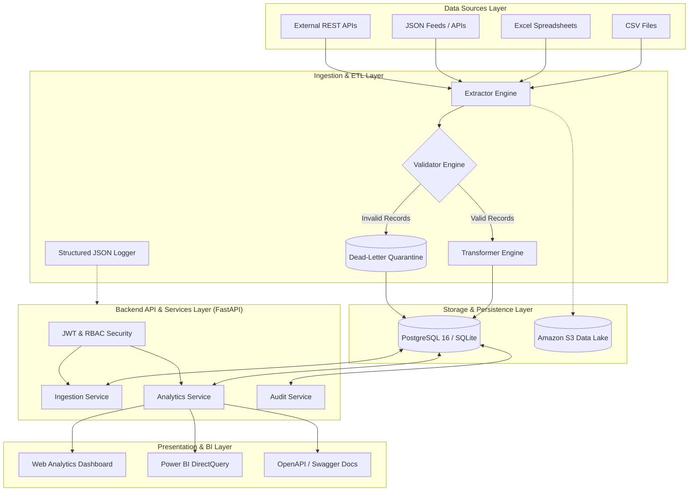
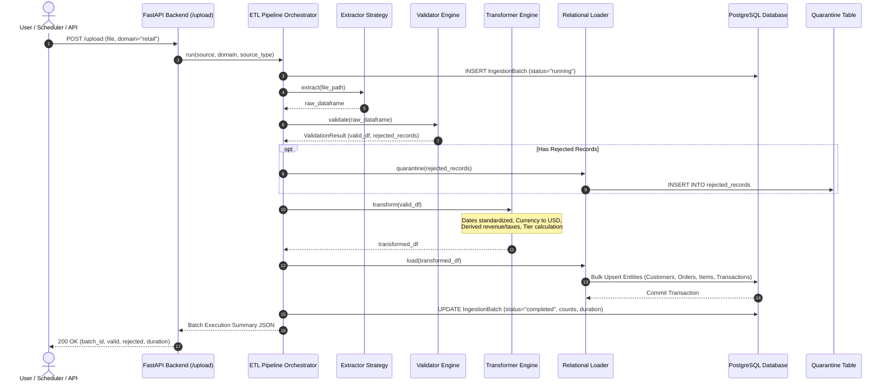

# Architecture Specification: Chronicle Ingestion & Analytics Platform

This document outlines the software architecture, design principles, component interactions, and data flow of the Chronicle platform.

---

## 1. High-Level Architectural Diagram

---

## 2. End-to-End Pipeline Execution Sequence Diagram

---

## 3. Core Architectural Principles

1. **Strategy Pattern for Extensibility**:
   Extractors (`CSVExtractor`, `ExcelExtractor`, `JSONExtractor`, `RestAPIExtractor`), Validators (`RetailValidator`, `BankingValidator`), and Transformers (`RetailTransformer`, `BankingTransformer`) implement common abstract base classes. Adding a new data source or business domain requires zero modifications to the core pipeline orchestrator.

2. **Strict Data Quality Gatekeeping**:
   Data corruption is stopped at the ingestion boundary. Valid records proceed to normalization and relational persistence, while invalid records are automatically quarantined into the `rejected_records` dead-letter table with the original row payload and explicit violation diagnostics.

3. **Separation of Concerns (Clean Architecture)**:
   - **API Layer**: Route handling, request validation, authentication, and HTTP response formatting.
   - **Service Layer**: Business logic, analytical aggregations, and audit logging.
   - **ETL Engine**: Data extraction, transformation algorithms, currency conversions, and bulk loading.
   - **Data Access Layer**: Normalized SQLAlchemy 2.0 ORM models and Alembic migrations.

4. **Database Portability**:
   Engine configurations automatically support production PostgreSQL (`postgresql+psycopg://...`) with connection pooling and local zero-configuration SQLite (`sqlite:///...`) for development and automated testing.
