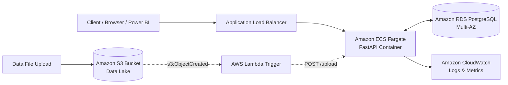

# AWS Cloud Production Deployment Guide

This guide details deploying the Chronicle platform to Amazon Web Services (AWS) using managed enterprise services:
* **Amazon S3**: Scalable object storage for uploaded files and raw data lakes.
* **Amazon RDS (PostgreSQL)**: Managed relational database with automated backups and Multi-AZ replication.
* **Amazon ECS (AWS Fargate)**: Serverless container execution for FastAPI and background ETL workers.
* **Amazon CloudWatch**: Centralized structured logging, health metrics, and alarms.
* **AWS Lambda (Optional)**: Event-driven automated ingestion trigger on S3 object creation.

---

## 1. AWS Architecture Diagram



---

## 2. Prerequisites

1. AWS CLI installed and configured (`aws configure`).
2. Terraform `>= 1.5.0` installed.
3. Docker installed for container image creation.
4. An AWS VPC with at least 2 public and 2 private subnets across availability zones.

---

## 3. Step-by-Step Deployment

### Step 1: Provision Infrastructure with Terraform

Navigate to the infrastructure directory:
```bash
cd infra/terraform
terraform init
terraform plan -out=tfplan
terraform apply tfplan
```

Note the outputs:
* `rds_endpoint`
* `s3_bucket_name`
* `ecs_cluster_name`

### Step 2: Build and Push Docker Image to Amazon ECR

1. Authenticate Docker with Amazon ECR:
```bash
aws ecr get-login-password --region us-east-1 | docker login --username AWS --password-stdin <AWS_ACCOUNT_ID>.dkr.ecr.us-east-1.amazonaws.com
```

2. Create an ECR repository (if not already created):
```bash
aws ecr create-repository --repository-name chronicle --region us-east-1
```

3. Build and tag the Docker image:
```bash
docker build -t chronicle:latest .
docker tag chronicle:latest <AWS_ACCOUNT_ID>.dkr.ecr.us-east-1.amazonaws.com/chronicle:latest
```

4. Push to ECR:
```bash
docker push <AWS_ACCOUNT_ID>.dkr.ecr.us-east-1.amazonaws.com/chronicle:latest
```

### Step 3: Run Database Migrations on RDS

Before starting ECS tasks, execute Alembic migrations against the RDS instance:
```bash
export DATABASE_URL="postgresql+psycopg://chronicle_admin:<PASSWORD>@<RDS_ENDPOINT>:5432/analytics_db"
alembic upgrade head
```

### Step 4: Deploy ECS Service

Update the ECS service to deploy the new container version:
```bash
aws ecs update-service \
  --cluster chronicle-cluster \
  --service chronicle-service \
  --force-new-deployment \
  --region us-east-1
```

---

## 4. Optional: Event-Driven S3 Ingestion with AWS Lambda

When data files are dropped into `s3://<bucket-name>/raw/`, an AWS Lambda function can trigger the ingestion API automatically.

### Lambda Function Code (`lambda_handler.py`):
```python
import json
import urllib.request
import os

API_ENDPOINT = os.environ.get("API_ENDPOINT", "http://alb.example.com/api/v1/upload")
API_TOKEN = os.environ.get("API_TOKEN", "")

def lambda_handler(event, context):
    for record in event.get("Records", []):
        bucket = record["s3"]["bucket"]["name"]
        key = record["s3"]["object"]["key"]
        
        # Infer domain from folder prefix (e.g. raw/retail/...)
        domain = "retail" if "retail" in key else "banking"
        
        payload = json.dumps({
            "s3_bucket": bucket,
            "s3_key": key,
            "domain": domain
        }).encode("utf-8")
        
        req = urllib.request.Request(
            f"{API_ENDPOINT}?domain={domain}",
            data=payload,
            headers={
                "Content-Type": "application/json",
                "Authorization": f"Bearer {API_TOKEN}"
            },
            method="POST"
        )
        with urllib.request.urlopen(req) as resp:
            print(f"Triggered ingestion for {key}: status {resp.status}")

    return {"statusCode": 200, "body": "Success"}
```

---

## 5. Monitoring & CloudWatch Logs

Container logs are streamed automatically to:
`/ecs/chronicle-api`

### CloudWatch Metric Alarm for Pipeline Errors:
```bash
aws cloudwatch put-metric-alarm \
  --alarm-name "Chronicle-ETL-Failures" \
  --metric-name "FailedIngestions" \
  --namespace "Chronicle" \
  --statistic Sum \
  --period 300 \
  --threshold 1 \
  --comparison-operator GreaterThanOrEqualToThreshold \
  --evaluation-periods 1
```
