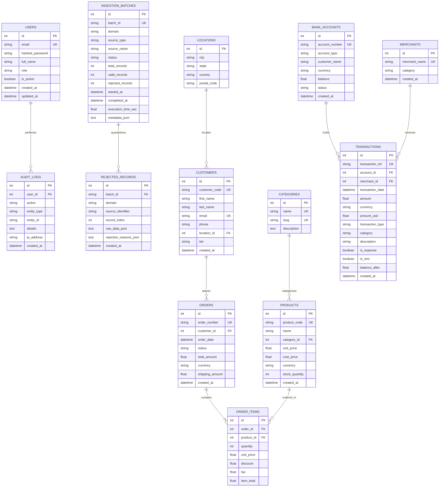

# Entity-Relationship Diagram (ERD) & Database Schema

This document details the normalized relational database schema powering the Chronicle platform.

---

## 1. Relational ER Diagram

---

## 2. Schema Design Rationale

### 3rd Normal Form (3NF) Compliance
- Entity attributes depend solely on their primary keys.
- Redundant data (e.g. repeated customer contact details in orders) is eliminated by referencing foreign keys.
- Product pricing and inventory reside in dimension tables, while immutable historical transaction prices are stored in order line items (`order_items.unit_price`).

### Natural Keys vs. Surrogate Keys
- **Surrogate Keys**: Integer primary keys (`id`) provide fast joins and indexing.
- **Natural Keys**: External reference codes (`customer_code`, `order_number`, `transaction_ref`, `product_code`) have unique constraints to prevent duplicate ingestion.

### Dead-Letter Queue Isolation
The `rejected_records` table captures malformed records as serialized JSON payloads (`raw_data_json`) and explicit diagnostic arrays (`rejection_reasons_json`), allowing downstream systems to audit quality without corrupting relational constraints.
